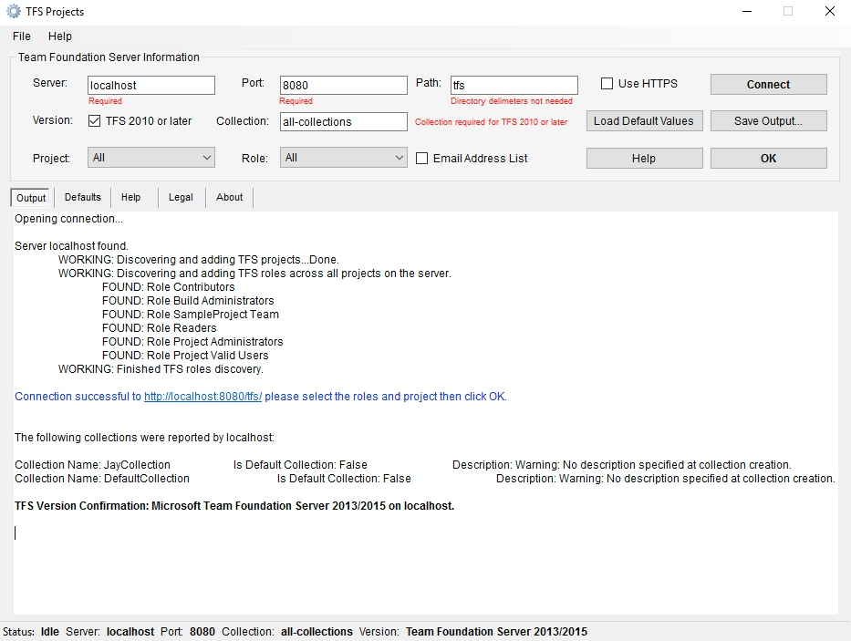

**Welcome CodePlex users!**

**UPDATE:  TFS Projects 2.1 is here!  I spent a lot of time polishing the project on this release, but there are many new features I think you will like as well.  Download it today!**

TFS Projects will provide a list of all users, by group, for each project or for only one project on a given Team Foundation Server instance via the TFS API.  

The default port for the instance is required, which is usually 8080 unless it has been customized, in which case you can specify your port in the app.  If you don't know the default port, ask your Team Foundation Server administrator.

There is much more information about each user that could be displayed, look at the IGroupSecurityService2 object for more info.  For this program I only used Name and MailAddress for the sake of brevity.

TFS Projects is a Windows Forms application, requiring .Net 4.5.  To make modifications download the source and load up in Visual Studio, the full project is in the zip file to make customizations easier.

If you need CSV output, check out the helper utility that **lgwapnitsky** wrote at https://tfsprojectstocsv.codeplex.com/ 

If you are using TFS 2005, check out http://tfsusers.codeplex.com for a comprehensive user audit check for that version of TFS.

Copyright 2017 Jay Eberhard.
